# Project Atlas
A voxel-based rendering engine built with OpenGL 4.6 Core and C++17 for Windows.

<h3>
Features:
</h3>

- Physically-inspired Water Rendering
- Post-Processing Fog
- Screen-Space Ambient Occlusion (SSAO)
- Fast Approximate Anti-Aliasing (FXAA)
- Camera View Frustum Culling
- Greedy Meshing for Chunks
- Memory-Efficient Vertex Storage
- Terrain generation using LibNoise
- Placement and deletion of blocks
- World data persistence:
    - Auto-saving world state
    - Manual save system

## Controls
- WASD – Move
- Mouse – Look (camera mode)
- Left Click – Break block
- Right Click – Place block

#### Input Modes
> **Note:** The application starts in camera control mode by default.
- **`=`** — Enable camera control mode
  - Allows free-look camera movement (mouse + keyboard).
- **`-`** — Enable cursor mode
  - Releases the mouse cursor for interacting with the ImGui control panel.
- **`Left Arrow`** — Hide ImGui panels
- **`Right Arrow`** — Show ImGui panels

<h2>
Preview
</h2>


<!--  -->
<h2>
Rendering & Engine Techniques
</h2>

This project focuses on implementing real-time rendering techniques that are commonly used in modern game engines. Each technique was implemented from scratch and integrated into a multi-pass rendering pipeline.

> **Note:** FPS comparisons were recorded at the same camera position. Relative gains are hardware-agnostic; absolute FPS varies by GPU.

### Rendering Pipeline Overview

1. G-buffer pass (normals + depth)
2. SSAO pass + blur
3. Water reflection & refraction passes
4. Forward render (scene objects)
5. Post-Processing Fog
6. FXAA
7. UI Elements

<!--  -->
---
<h4>
Physically-inspired Water Rendering
</h4>

- Water is rendered using a dedicated pass that captures the scene above and below the water plane into reflection and refraction textures.
- Utilizes Fresnel-based reflection/refraction blending.
- DuDv mapping for wave distortion effects coupled with time-based animation.
- Refraction depth texture used to make shallow water appear lighter in color.

**Why it matters:**  
Previous versions of this engine showcased flat and boring water blocks. Water is now more visually appealing and takes into account other objects in the scene.

<!--  -->
---
<h4>
Post-Processing Fog
</h4>

- Screen-space, depth-based fog applied as a post-processing pass.
- Configurable fog color and start/end distances.
- Integrates seamlessly with SSAO, FXAA, and lighting passes.

**Why it matters:**  
Demonstrates the ability to implement additional post-processing effects that integrate cleanly into an existing post-processing pipeline.

<!--  -->
---
<h4>
Screen-Space Ambient Occlusion (SSAO)
</h4>

- Utilizes a G-buffer that stores view space normals and depth.
- Generates a random sample kernel in view space and projects samples into screen space.
- Calculates occlusion by comparing sampled depth values against the current fragment depth.
- A blur pass is applied to reduce high frequency noise while preserving edge detail.

**Why it matters:**  
SSAO adds depth perception and contact shadows without the cost of full global illumination, significantly improving visual realism in dense voxel environments.

<!--  -->
---
<h4>
Fast Approximate Anti-Aliasing (FXAA)
</h4>

- Implements FXAA 3.11 by Timothy Lottes  
  (based on https://gist.github.com/kosua20/0c506b81b3812ac900048059d2383126)
- A post-processing pass that operates on the final scene color buffer.
- Identifies and smooths jagged edges.

**Why it matters:**  
FXAA is a cost-efficient method for anti-aliasing with minimal performance cost that is ideal for voxel engines.

<!--  -->
---
<h4>
View Frustum Culling
</h4>


- Each chunk is tested against the camera's view frustum using Axis-Aligned Bounding Box (AABB) vs frustum plane checks. 
- Only the chunks visible from inside the frustum are rendered.
- Integrated directly into the chunk manager (CPU side) to avoid extra GPU load through draw calls.
- Noticeable performance increase from 679 FPS to 1057 FPS (~56% improvement) measured on an RTX 5090 at the same camera position.

**Why it matters:**  
Frustum culling drastically reduces GPU workload by efficiently rendering only the chunks visible in camera view, reducing overhead and increasing performance as the world grows in size.

<!--  -->
---
<h4>
Greedy Meshing
</h4>

- The chunk mesh is generated using greedy meshing, which scans each chunk in three passes (one per axis).
- For each pass, adjacent voxels are compared to detect visible faces. Adjacent faces that match in attributes are merged into larger quads.
- Noticeable performance increase from 342 FPS to 662 FPS (~94% improvement) measured on an RTX 5090 at the same camera position.

**Why it matters:**  
Greedy meshing reduces the number of draw calls and triangles sent to the GPU, improving overall rendering performance.

<!--  -->
---
<h4>
Memory-Efficient Vertex Storage
</h4>

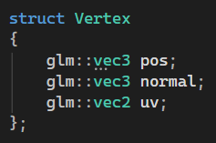
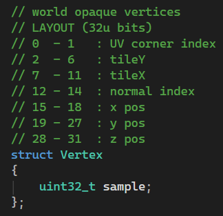

- Significantly reduced the per-vertex memory footprint for opaque geometry.
- Previously, each vertex stored position (vec3), normal (vec3), and UV (vec2) totaling 32 bytes. New version packs this data inside a single uint32_t (4 bytes).
- ~88% reduction in RAM usage: 1579 MB -> 185 MB.
- ~14% reduction in VRAM usage: 5282 MB -> 4526 MB.

> **Note:** VRAM reduction is smaller than RAM reduction due to textures and framebuffers dominating total GPU memory usage.

**Why it matters:**  
Smaller vertices reduce CPU memory pressure, improve cache efficiency, and allow significantly larger worlds and higher chunk counts without exhausting system memory.

<!--  -->
---
<h4>
Procedural Terrain Generation
</h4>

- Utilizes the LibNoise library to generate a terrain heightmap.
- This allows for varied terrain features such as hills, oceans, and trees.

**Why it matters:**  
Procedural generation allows for large and varied worlds without having to worry about doing so by hand, while also maintaining a deterministic state.

<!--  -->
---
<h4>
World State Persistence System
</h4>

- Chunk data is serialized to disk using a custom save format.
- Supports both manual and automatic saving.
- As the player modifies (place/destroy blocks) the world, these changes persist through application shutdown and restart.

**Why it matters:**  
Persistent world state demonstrates data-oriented design beyond real-time rendering.

---
<!--  -->
<!--  -->
<h2>
Milestones
</h2>

| Terrain Generation + Skybox |
|---------|
| *Initial terrain generation using a simple heightmap.* |
| 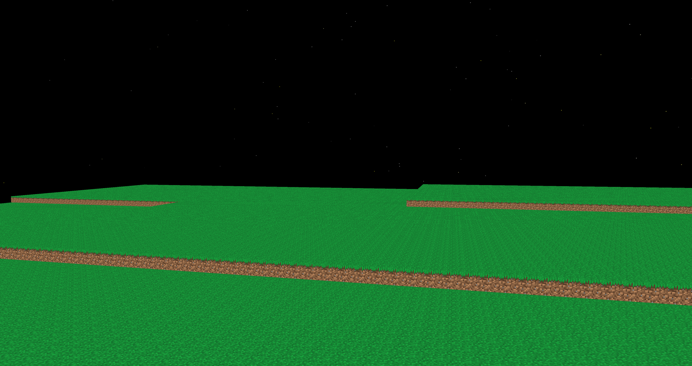|

| Terrain Generation w/LibNoise |
|---------|
| *Terrain generation using LibNoise for more interesting views, trees are WIP.* |
| |

| Proper Tree Generation |
|---------|
| *Updated tree generation to randomly construct canopy.* |
| 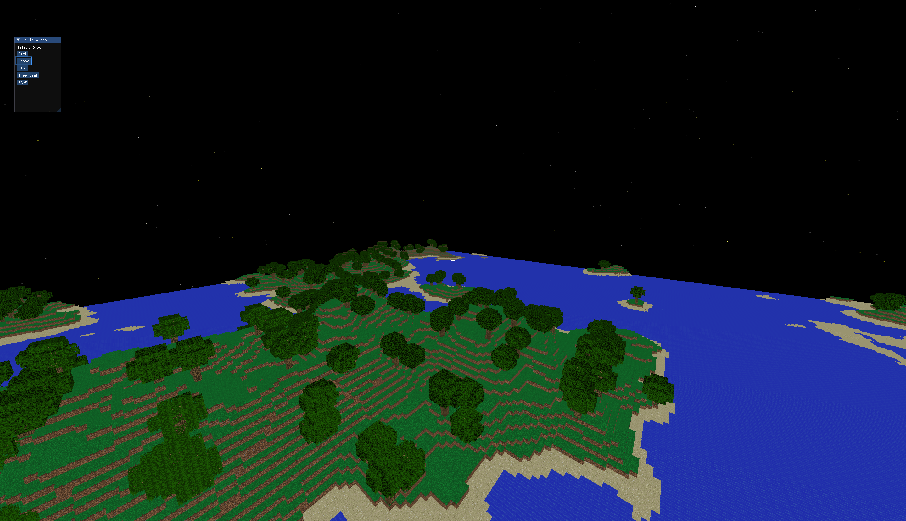|

| G-buffer Normal | G-buffer Depth |
|----------------------------|--------------------------------|
| *Working on implementing SSAO. Implemented G-buffer with debug view for surface normals.* | *Working on implementing SSAO. Implemented G-buffer with debug view for depth.* |
| 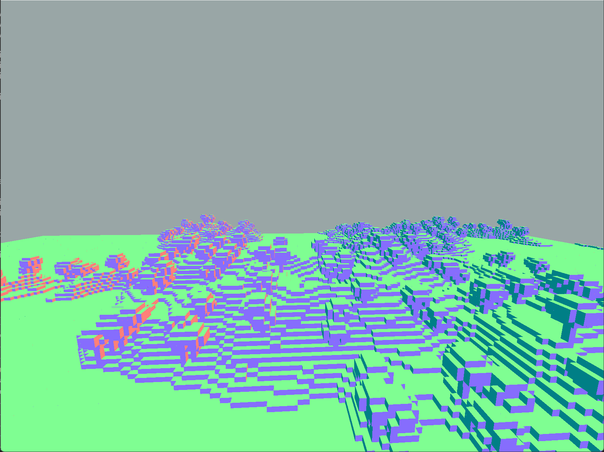 | 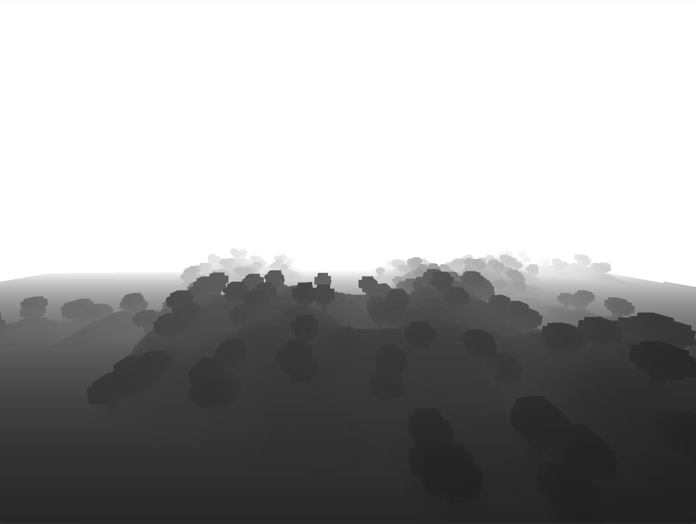 |

| SSAO (Off) | SSAO (On) |
|----------------------------|--------------------------------|
| *Previous version of engine before implementation of SSAO.* | *SSAO significantly improves scene depth by enhancing contact shadows at the intersections where blocks meet. This helps improve the detail of the geometry.* |
| 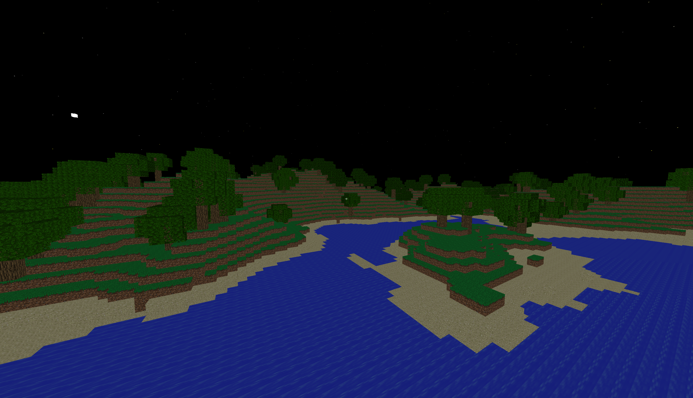 |  |

| Frustum Culling (Off) | Frustum Culling (On) |
|----------------------------|--------------------------------|
| *FPS: 679* | *FPS: 1057* = ~56% Increase in performance|
| 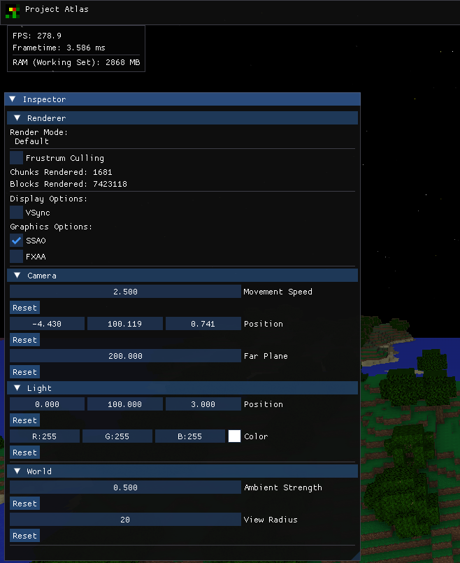 | 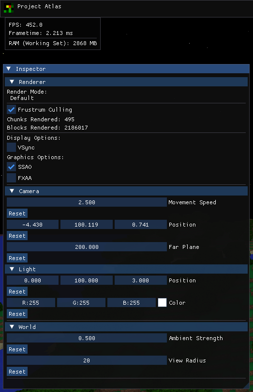 | 
| 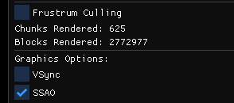 | 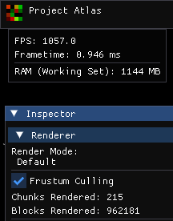 | 

| FXAA (Off) | FXAA (On) |
|----------------------------|--------------------------------|
| *FXAA is turned off. The edges of the white cube are jagged.* | *FXAA helps to smooth out the jagged edges of objects in view. The white cube displays edges that have been noticeably smoothed.* |
| 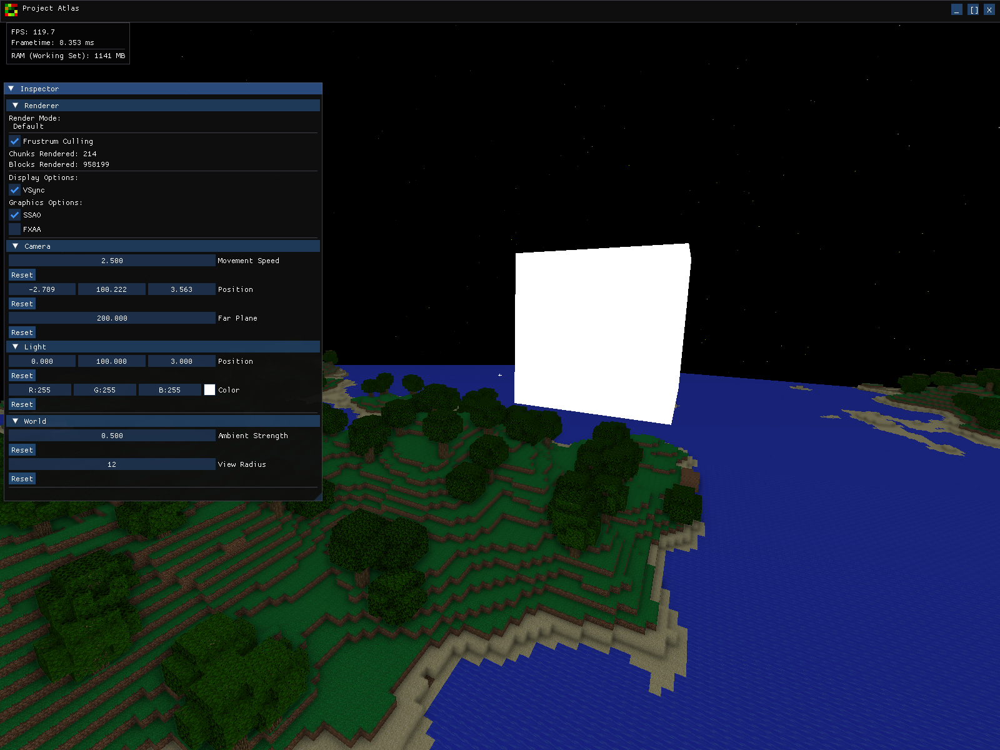 | 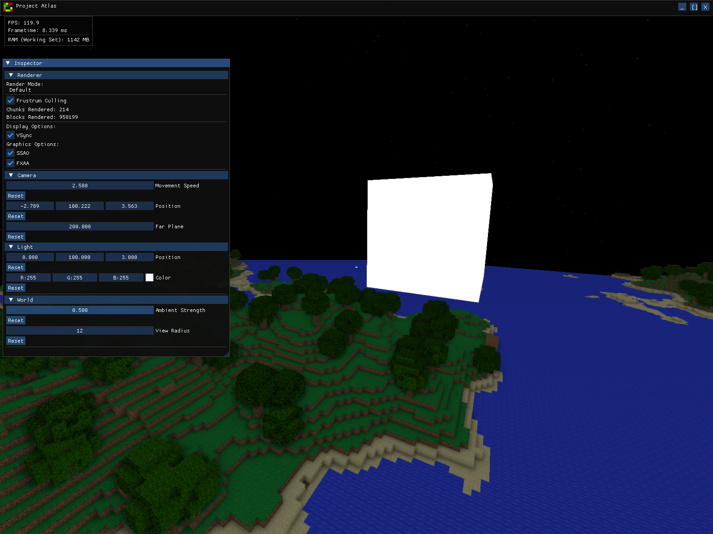 | 
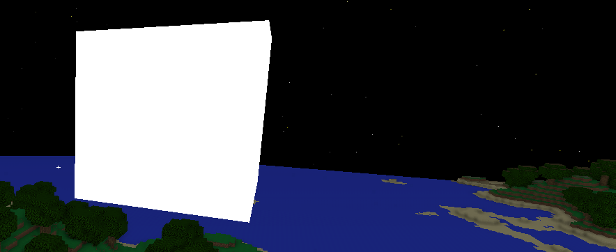 | 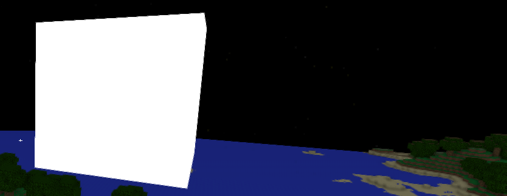 |

| Flat Water | Beautiful Water |
|----------------------------|--------------------------------|
| *Previous version of engine using static water textures.* | *Enhanced water using reflection/refraction textures, and DuDv distortion.* |
| 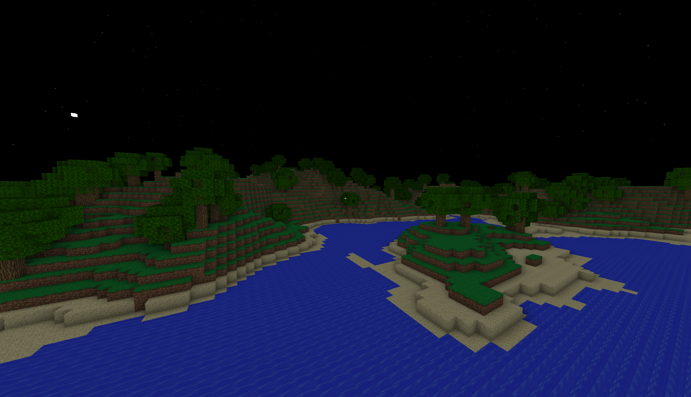 | 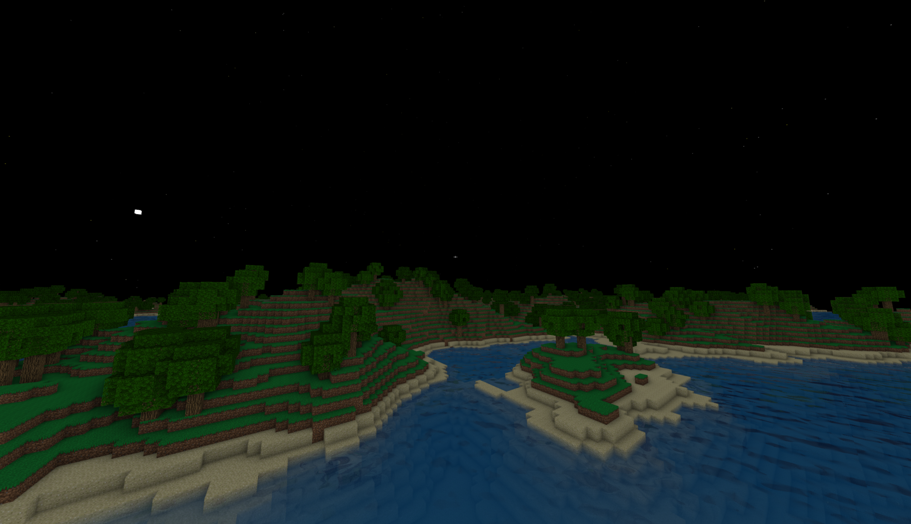 |

| Fog (Off) | Fog (On) |
|----------------------------|--------------------------------|
| *World rendered without fog enabled.* | *Post-processing fog used to obscure objects further away.* |
| 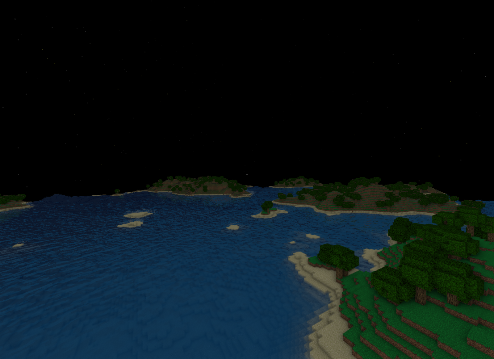 | 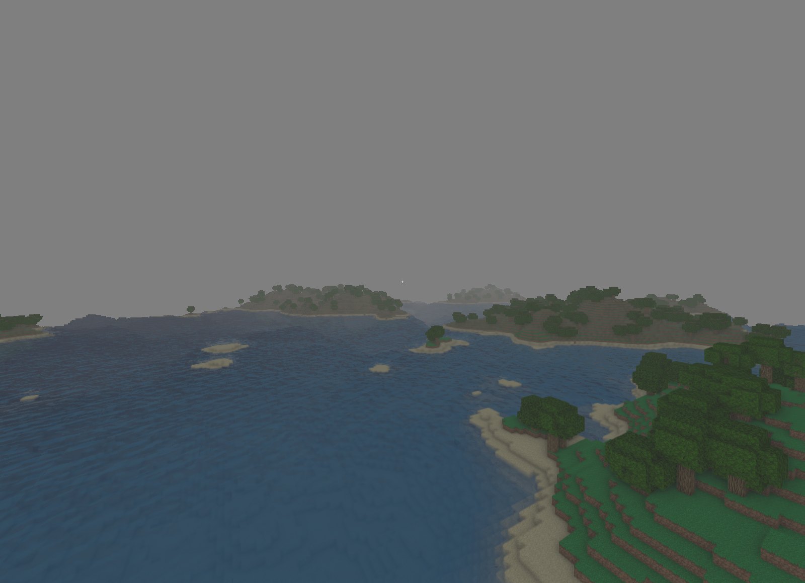 |

| Optimizations (Off) | Optimizations (On) |
|----------------------------|--------------------------------|
| *World rendered without frustum culling, vertex memory reduction, and greedy meshing.* | *World rendered WITH frustum culling, vertex memory reduction, and greedy meshing.* |
| *FPS: 342* | *FPS: 662 = ~94%  Increase in Performance* |
| |*~88% reduction in RAM usage: 1579 MB -> 185 MB.* |
| 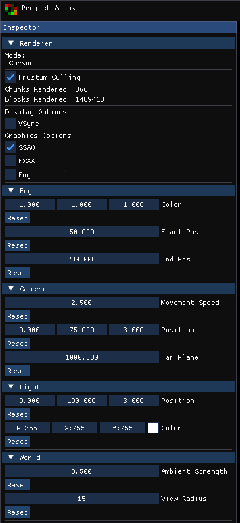 | 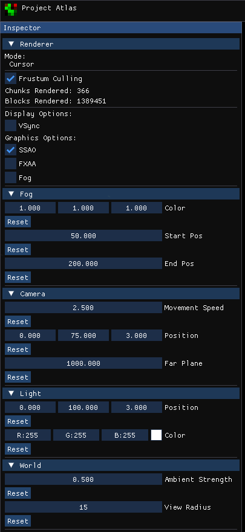 |
| 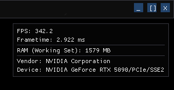 | 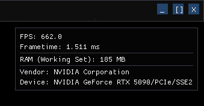 |

<h2>
Requirements
</h2>

> - [Download](https://git-scm.com/install/) and install Git
> - [Download](https://visualstudio.microsoft.com/vs/community/) Visual Studio 2022 Community Edition or newer.
> -- Install workloads: *Desktop development with C++*.
> - [Download](https://cmake.org/download/) and install CMake (>= v3.31.0).

<h2>
Build
</h2>

- Clone repo:
```
git clone https://github.com/RobRob7/ProjectAtlas.git
```
- Then run commands:
```
cd ProjectAtlas
mkdir build
cd build
cmake ..
cmake --build . --config Release
```
<h2>
Run
</h2>

- For Command Prompt:

```
cd Release
Atlas.exe
```
- For Git Bash:
```
cd Release
./Atlas.exe
```


<h2>
Dependencies
</h2>

Libraries already provided, the following are used:
|Library|Usage|Version|
|-------|-------|-----|
|[FreeType](https://freetype.org/download.html)|Font rendering|v2.10.0|
|[Glad](https://glad.dav1d.de/)|OpenGL loader generator|N/A|
|[GLFW](https://www.glfw.org/download.html)|API for creating windows, contexts and surfaces, receiving input and events|v3.4|
|[GLM](https://github.com/g-truc/glm/releases/tag/1.0.1)|Header only C++ mathematics library|v1.01|
|[ImGui](https://github.com/ocornut/imgui/releases/tag/v1.92.5)|Bloat-free Graphical User interface for C++|v1.92.5|
|[LibNoise](https://libnoise.sourceforge.net/)|A portable, open-source, coherent noise-generating library for C++|v1.0.0|

<h2>
Project Structure
</h2>

Project layout:
- **include/**
  - internal header files
- **src/**
    - main.cpp → main driver
    - **chunk/**
        - chunkdata.cpp → chunk data
        - chunkmanager.cpp → management of chunk meshes
        - chunkmesh.cpp → chunk mesh
    - **core/**
        - application.cpp → main application
        - scene.cpp → object setup + renderer call
    - **light/**
        - light.cpp → light cube object
    - **player/**
        - crosshair.cpp → crosshair UI icon
    - **renderer/**
        - debugpass.cpp → G-buffer normal + depth view
        - fogpass.cpp → fog pass
        - fxaapass.cpp → FXAA pass
        - gbufferpass.cpp → G-buffer pass
        - presentpass.cpp → helper pass
        - renderer.cpp → render pipeline
        - ssaopass.cpp → SSAO pass
        - waterpass.cpp → water pass
    - **save/**
        - save.cpp → world state saving
    - **system/**
        - camera.cpp → camera system
    - **utility/**
        - cubemap.cpp → setup + render cubemap
        - shader.cpp → shader helper class
        - texture.cpp → setup texture
- **res/**
  - **shader/** → Shaders
  - **texture/** → Textures
- **deps/** → Dependency files
- **papers/** → Papers implemented
